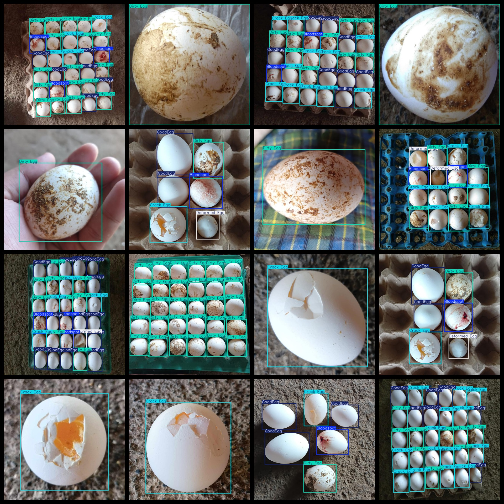
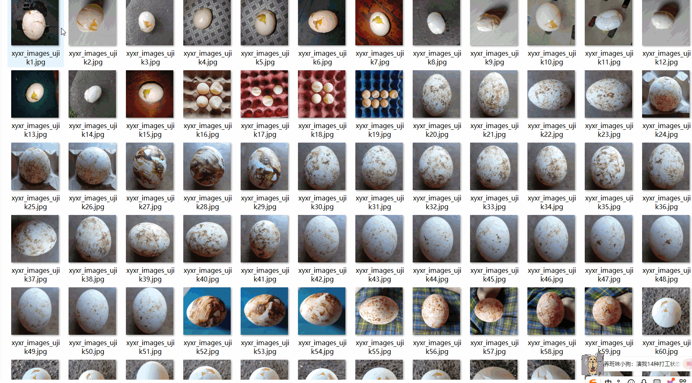

# Egg Crack Dirty Detection Dataset 1408 imagesYOLO-VOC

The Egg Crack Dirty Detection Dataset consists of 1408 images in VOC format and YOLO format. The dataset is organized into three folders: JPEGImages, Annotations, and labels.

The JPEGImages folder contains a total of 1408 jpg images.

The Annotations folder contains a total of 1408 xml files.

The labels folder contains a total of 1408 txt files.

There are a total of 5 categories in the dataset: "Bloodspot", "Crack Egg", "Deformed Egg", "Dirty Egg", and "Good Egg".

Each category has a different number of frames (please note that the order of categories in the YOLO format may not match this, but it aligns with the classes.txt file in the labels folder).

- Bloodspot: 1300 frames
- Crack Egg: 4061 frames
- Deformed Egg: 1569 frames
- Dirty Egg: 5002 frames
- Good Egg: 5070 frames

The total number of frames across all categories is 17002.

The image resolution is clear.

All images have been enhanced.

The shape of the labels is rectangular boxes, used for object detection recognition.

Special Note: This dataset does not guarantee the accuracy or precision of any trained models or weight files. It only provides accurate and reasonable annotations.

Important Notice: No special declaration is made regarding this dataset's accuracy guarantee to the models or weights files being trained. The dataset only provides accurate and reasonable annotations.

## Images

---

Here is a pay link on Stripe (https://buy.stripe.com/3cs8yP7sY87d0vu9AB). Please contact me lonlonago@foxmail.com after funding $89, and I will send you a complete data files, thank you!

